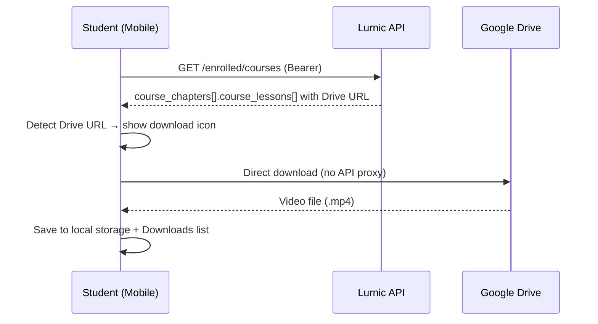

# Lesson Offline Download (Google Drive) — Backend Implementation Guide

**API base:** `https://<api-host>/v1`  
**Backend repo:** `lurnic-server/api` (Go + Gin + MySQL)  
**Mobile client:** `mobile/src/lib/offlineDownloads.ts`  
**Web client:** offline download নেই (শুধু mobile)

---

## Table of contents

1. [Overview](#1-overview)
2. [Current architecture](#2-current-architecture)
3. [Backend responsibilities](#3-backend-responsibilities)
4. [Lesson data contract](#4-lesson-data-contract)
5. [Admin panel requirements](#5-admin-panel-requirements)
6. [Storefront API endpoints](#6-storefront-api-endpoints)
7. [Optional: `google_drive` source type](#7-optional-google_drive-source-type)
8. [Optional: proxy download endpoint](#8-optional-proxy-download-endpoint)
9. [Authorization & enrollment rules](#9-authorization--enrollment-rules)
10. [Google Drive file requirements](#10-google-drive-file-requirements)
11. [QA checklist](#11-qa-checklist)
12. [Implementation status](#12-implementation-status)

---

## 1. Overview

Mobile app-এ enrolled student Google Drive video link থাকা lesson **offline save** করতে পারে।  
এটি **client-side feature** — mobile সরাসরি Google Drive থেকে file download করে device storage-এ রাখে।

**Backend-এ নতুন endpoint বাধ্যতামূলক নয়** (v1 implementation)।  
Backend-এর কাজ: lesson API response-এ Drive URL সঠিকভাবে return করা এবং enrolled student-কে সেই data access দেওয়া।

### User flow (mobile)



---

## 2. Current architecture

| Layer | Responsibility |
|-------|----------------|
| **Admin** | Lesson-এ Google Drive share link save (`source.data.data`) |
| **Backend** | Enrolled student-এর জন্য lesson object return (URL intact) |
| **Mobile** | Drive URL detect → download → local play |
| **Web** | Offline download support নেই |

### Mobile client — Drive URL detection order

`downloadUrlForLesson()` এই সোর্সগুলো থেকে URL খোঁজে (priority order):

1. `lesson.source.data.data` — primary video URL
2. `lesson.resources[]` — attachment `file_path` / `url`
3. `lesson.description` — HTML `<a href="...">` links
4. `lesson.description` + `source.data.data` — regex দিয়ে embedded Drive URLs

### Supported Drive URL formats (mobile regex)

```
https://drive.google.com/file/d/{FILE_ID}/view
https://drive.google.com/file/d/{FILE_ID}/edit
https://drive.google.com/open?id={FILE_ID}
https://drive.google.com/uc?export=download&id={FILE_ID}
https://docs.google.com/uc?export=download&id={FILE_ID}
https://drive.usercontent.google.com/download?id={FILE_ID}
```

### What is NOT downloadable (mobile rules)

| Source | Offline save |
|--------|--------------|
| YouTube (`source_type: youtube`) | ❌ |
| Vimeo (`source_type: vimeo`) | ❌ |
| Google Drive **video** link | ✅ |
| Google Drive **PDF** link | ❌ (material হিসেবে open হয়) |
| Direct `.mp4` / hosted upload URL | ✅ |
| `sound_cloud`, `spotify` | ❌ |

---

## 3. Backend responsibilities

### Must have (v1 — no new endpoint)

- [ ] Lesson `source.data.data`-তে full Google Drive share URL store ও return করা
- [ ] `GET /enrolled/courses` nested curriculum-এ lesson object complete return
- [ ] `GET /course/{slug}` enrolled/unlocked lesson-এ Drive URL strip না করা
- [ ] HTML `description` sanitize করলে Drive `<a href>` link রাখা
- [ ] `resources[].file_path` বা `url` field populate করা (attachment হলে)

### Should have (recommended)

- [ ] Admin validation: Drive URL format check on save
- [ ] `source_type: "google_drive"` enum support (see §7)
- [ ] Lesson response-এ `offline_downloadable: true` computed field

### Nice to have (v2 — if direct Drive download fails often)

- [ ] Proxy download endpoint (see §8)
- [ ] Server-side Drive file metadata fetch (`mimeType`, `fileSize`)

---

## 4. Lesson data contract

### Minimum lesson object (enrolled student view)

```json
{
  "id": 42,
  "title": "Chapter 1 — Introduction",
  "description": "<p>Class notes and reference.</p>",
  "lesson_type": "video",
  "source_type": "upload",
  "source": {
    "data": {
      "data": "https://drive.google.com/file/d/1AbCdEfGhIjKlMnOpQrStUvWxYz/view?usp=sharing",
      "is_file": false,
      "playback_times": "00:15:30"
    }
  },
  "resources": [],
  "is_published": true,
  "is_public": false,
  "position": 1,
  "chapter_id": 7
}
```

### Alternative: Drive link in description (fallback)

```json
{
  "id": 43,
  "title": "Chapter 2 — Deep Dive",
  "lesson_type": "video",
  "source_type": "custom_code",
  "source": {
    "data": {
      "data": "",
      "is_file": false
    }
  },
  "description": "<p>Watch here: <a href=\"https://drive.google.com/file/d/1XyZ987654321/view\">Video</a></p>",
  "is_published": true,
  "is_public": false
}
```

> Mobile `description` থেকেও Drive URL extract করে — তবে **primary recommendation:** `source.data.data`-তে রাখা।

### Resource attachment with Drive link

```json
{
  "resources": [
    {
      "id": 10,
      "title": "Lecture Video",
      "mime_type": "video/mp4",
      "file_path": "https://drive.google.com/file/d/1AbCdEfGhIjKlMnOpQrStUvWxYz/view",
      "url": "https://drive.google.com/file/d/1AbCdEfGhIjKlMnOpQrStUvWxYz/view",
      "position": 1,
      "file_size": 0
    }
  ]
}
```

### Recommended v2 fields (optional)

```json
{
  "source_type": "google_drive",
  "source": {
    "data": {
      "data": "https://drive.google.com/file/d/1AbCdEfGhIjKlMnOpQrStUvWxYz/view",
      "is_file": false,
      "drive_file_id": "1AbCdEfGhIjKlMnOpQrStUvWxYz",
      "playback_times": "00:15:30"
    }
  },
  "offline_downloadable": true,
  "download_url": "https://drive.google.com/file/d/1AbCdEfGhIjKlMnOpQrStUvWxYz/view"
}
```

| Field | Type | Notes |
|-------|------|-------|
| `source.data.data` | `string` | **Required** — full share URL |
| `source.data.is_file` | `boolean` | `false` for Drive links |
| `source.data.drive_file_id` | `string` | Optional — extracted file ID |
| `source.data.playback_times` | `string` | Optional — `HH:MM:SS` or seconds |
| `offline_downloadable` | `boolean` | Optional — computed by backend |
| `download_url` | `string` | Optional — explicit download source |

---

## 5. Admin panel requirements

### Lesson create/edit form

| Field | Rule |
|-------|------|
| `lesson_type` | Must be `video` for offline video save |
| `source_type` | `upload` (v1) or `google_drive` (v2) |
| Video URL input | Accept full Google Drive share link |
| Validation | Regex: `drive\.google\.com\/file\/d\/[a-zA-Z0-9_-]+` or `id=` param |

### Admin validation (Go example)

```go
var driveFileIDPattern = regexp.MustCompile(
    `(?:drive\.google\.com/file/d/|drive\.google\.com/open\?[^#]*[?&]id=|drive\.google\.com/uc\?[^#]*[?&]id=)([a-zA-Z0-9_-]+)`,
)

func ExtractDriveFileID(raw string) (string, bool) {
    raw = strings.TrimSpace(raw)
    if raw == "" {
        return "", false
    }
    m := driveFileIDPattern.FindStringSubmatch(raw)
    if len(m) < 2 {
        return "", false
    }
    return m[1], true
}
```

### Admin save logic (recommended)

```
IF lesson_type == "video" AND source contains Drive URL:
  source_type = "google_drive"   // v2
  source.data.data = normalized share URL
  source.data.drive_file_id = extracted FILE_ID
  source.data.is_file = false
```

### Do NOT

- Drive URL-কে relative path বা CDN path-এ convert করা
- Enrolled student response থেকে `source.data.data` hide করা (শুধু public preview-এ hide করা যেতে পারে)
- PDF Drive link-কে video lesson-এ save করা (mobile skip করবে, কিন্তু UX খারাপ)

---

## 6. Storefront API endpoints

Backend-এ **নতুন endpoint ছাড়াই** কাজ করে যদি নিচের endpoint-গুলো সঠিক lesson data return করে।

### Primary endpoints

| Method | Path | Auth | Lesson data needed |
|--------|------|------|-------------------|
| `GET` | `/enrolled/courses` | Bearer | Full nested `course.course_chapters[].course_lessons[]` |
| `GET` | `/course/{slug}` | `app-key` (+ optional Bearer) | Full curriculum for enrolled preview |

### `/enrolled/courses` — critical nested shape

```json
{
  "data": [
    {
      "id": 1,
      "course_id": 5,
      "student_id": 12,
      "course": {
        "id": 5,
        "slug": "hsc-physics",
        "title": "HSC Physics",
        "course_chapters": [
          {
            "id": 7,
            "title": "Chapter 1",
            "course_lessons": [
              {
                "id": 42,
                "title": "Introduction",
                "lesson_type": "video",
                "source_type": "upload",
                "source": {
                  "data": {
                    "data": "https://drive.google.com/file/d/1AbCdEfGhIjKlMnOpQrStUvWxYz/view",
                    "is_file": false
                  }
                },
                "description": null,
                "resources": [],
                "is_published": true,
                "is_public": false,
                "position": 1,
                "chapter_id": 7
              }
            ]
          }
        ]
      }
    }
  ]
}
```

**Backend module:** `modules/enrollment` → `course.LoadPublicCoursesByIDs()` (batch load)

### Fields that must NOT be omitted for enrolled students

```json
"source": { "data": { "data": "<DRIVE_URL>" } }
"description"
"resources"
"lesson_type"
"source_type"
"is_public"
"is_published"
```

---

## 7. Optional: `google_drive` source type

### TypeScript / API enum extension

```typescript
type LessonSourceType =
  | "youtube"
  | "vimeo"
  | "custom_code"
  | "upload"
  | "google_drive"   // NEW
  | "sound_cloud"
  | "spotify";
```

### Database / model change

```sql
-- If source_type is ENUM, extend it:
ALTER TABLE course_lessons
  MODIFY COLUMN source_type ENUM(
    'youtube', 'vimeo', 'custom_code', 'upload',
    'google_drive', 'sound_cloud', 'spotify'
  ) NOT NULL DEFAULT 'upload';
```

### Backend serializer

```go
type LessonSourceData struct {
    Data           string  `json:"data"`
    IsFile         bool    `json:"is_file"`
    PlaybackTimes  *string `json:"playback_times,omitempty"`
    DriveFileID    *string `json:"drive_file_id,omitempty"` // NEW
}

func (l *CourseLesson) OfflineDownloadable() bool {
    if l.LessonType != "video" {
        return false
    }
    url := l.Source.Data.Data
    if _, ok := ExtractDriveFileID(url); ok {
        return true
    }
    if isDirectVideoURL(url) {
        return true
    }
    return false
}
```

Mobile client v1-এ `source_type` check করে না — URL দেখে detect করে।  
`google_drive` type যোগ করলে admin validation ও future web player support সহজ হয়।

---

## 8. Optional: proxy download endpoint

Direct Google Drive download mobile-এ fail করতে পারে যখন:

- File "virus scan warning" page return করে
- Drive link restricted / quota exceeded
- Google blocks mobile User-Agent

### Endpoint spec (v2)

```
GET /v1/course/{slug}/lessons/{lessonId}/download
```

**Headers:**
```
Authorization: Bearer <student_jwt>
app-key: <tenant_key>
```

**Auth rules:**
1. Student must be enrolled in course
2. Lesson must belong to course
3. Lesson must have downloadable source (Drive or hosted video)

**Response options:**

#### Option A — 302 redirect to signed URL

```
HTTP/1.1 302 Found
Location: https://cdn.example.com/signed/lesson_42.mp4?token=...
```

#### Option B — JSON with temporary URL

```json
{
  "data": {
    "download_url": "https://cdn.example.com/signed/lesson_42.mp4?token=...",
    "expires_at": "2026-09-02T10:30:00Z",
    "file_name": "chapter-1-intro.mp4",
    "content_type": "video/mp4",
    "file_size": 157286400
  }
}
```

**Errors:**

| HTTP | error code | When |
|------|------------|------|
| `401` | `UNAUTHORIZED` | No/invalid JWT |
| `403` | `NOT_ENROLLED` | Student not enrolled |
| `404` | `LESSON_NOT_FOUND` | Invalid lesson/course |
| `422` | `NOT_DOWNLOADABLE` | YouTube/Vimeo/PDF lesson |
| `502` | `DRIVE_FETCH_FAILED` | Server cannot fetch from Drive |

### Backend implementation sketch (Go)

```go
// modules/course/handler_download.go

func (h *Handler) DownloadLesson(c *gin.Context) {
    slug := c.Param("slug")
    lessonID, _ := strconv.Atoi(c.Param("lessonId"))
    studentID := middleware.GetStudentID(c)

    course, err := h.svc.GetCourseBySlug(slug)
    if err != nil { /* 404 */ }

    if !h.enrollment.IsEnrolled(studentID, course.ID) {
        c.JSON(403, gin.H{"error": "NOT_ENROLLED"})
        return
    }

    lesson, err := h.svc.GetLesson(course.ID, lessonID)
    if err != nil { /* 404 */ }

    sourceURL := lesson.Source.Data.Data
    fileID, ok := ExtractDriveFileID(sourceURL)
    if !ok {
        c.JSON(422, gin.H{"error": "NOT_DOWNLOADABLE"})
        return
    }

    // Option 1: redirect to Drive direct download (thin proxy)
    redirectURL := fmt.Sprintf(
        "https://drive.usercontent.google.com/download?id=%s&export=download&confirm=t",
        fileID,
    )
    c.Redirect(302, redirectURL)

    // Option 2: stream via server / R2 cache (heavy, better reliability)
}
```

### When to implement proxy

| Scenario | Recommendation |
|----------|----------------|
| Drive links work reliably on mobile | Skip proxy (v1) |
| Many students report download failure | Add thin redirect proxy |
| Private/restricted Drive files | Server-side fetch + R2/CDN cache required |
| Large files (>100MB) | Signed CDN URL recommended |

---

## 9. Authorization & enrollment rules

| Viewer | `source.data.data` (Drive URL) | Offline download (mobile) |
|--------|-------------------------------|---------------------------|
| Not logged in | Hidden for non-`is_public` lessons | ❌ |
| Logged in, not enrolled | Hidden for locked lessons | ❌ |
| Enrolled student | **Must return full URL** | ✅ |
| `is_public: true` preview lesson | Return URL | ✅ (if enrolled for save button) |

### Important

Mobile download button শুধু **enrolled** student-এর জন্য দেখায় (`CourseDetailScreen`: `enrolled && isDownloadableLesson(lesson)`).

Backend-এ enrolled student-এর lesson response-এ URL missing হলে mobile-এ download icon আসবে না — এটাই সবচেয়ে common integration bug।

---

## 10. Google Drive file requirements

Admin/Instructor-কে এই নিয়ম follow করতে বলুন:

1. File type: **video** (`.mp4`, `.m4v`, `.webm`, `.mov`)
2. Share setting: **"Anyone with the link" → Viewer** (minimum)
3. Link format: Full `drive.google.com/file/d/.../view` URL (not shortened `goo.gl`)
4. PDF/note হলে `resources[]`-এ রাখুন, primary `source.data.data`-তে নয়

### Common failure causes

| Problem | Symptom | Fix |
|---------|---------|-----|
| Private Drive file | Download returns HTML login page | Change share to "Anyone with link" |
| PDF in video source | No download icon | Move to resources or use actual video URL |
| URL truncated in DB | Mobile cannot parse file ID | Increase column size / validate on save |
| `source.data.data` empty, only in admin notes | No download | Copy URL to `source.data.data` |

---

## 11. QA checklist

### Backend API tests

```bash
API_URL="https://api.minaracademy.com/v1"
TOKEN="<student_jwt>"
SLUG="hsc-physics"

# 1. Enrolled courses returns Drive URL
curl -s "$API_URL/enrolled/courses" \
  -H "Authorization: Bearer $TOKEN" \
  -H "app-key: $APP_KEY" \
  | jq '.data[].course.course_chapters[].course_lessons[] | select(.source.data.data | test("drive.google.com"))'

# 2. Course detail returns same URL for enrolled student
curl -s "$API_URL/course/$SLUG" \
  -H "Authorization: Bearer $TOKEN" \
  -H "app-key: $APP_KEY" \
  | jq '.data.course_chapters[].course_lessons[] | select(.id == 42)'
```

### Expected results

- [ ] Drive URL present in `source.data.data` for enrolled student
- [ ] URL not stripped/truncated
- [ ] `description` HTML links preserved
- [ ] Non-enrolled student does NOT get locked lesson URLs
- [ ] `is_public: true` preview lessons work for anonymous users

### Mobile integration tests

- [ ] Course detail → lesson row shows download icon
- [ ] Tap download → progress indicator
- [ ] Downloads screen → lesson appears after complete
- [ ] Airplane mode → lesson plays from local file
- [ ] PDF Drive link → no video download icon (opens as material)

### Admin tests

- [ ] Save Drive URL in lesson form → persists correctly
- [ ] Re-open edit form → URL unchanged
- [ ] Invalid URL → validation error

---

## 12. Implementation status

| Item | Status | Owner |
|------|--------|-------|
| Mobile offline download (Drive detect + save) | ✅ Done | `mobile/` |
| Mobile UI (download icon, Downloads screen) | ✅ Done | `mobile/` |
| Backend: return Drive URL in lesson response | ⚠️ Verify | `lurnic-server/api` |
| Backend: `google_drive` source_type enum | ❌ Not started | `lurnic-server/api` |
| Backend: proxy download endpoint | ❌ Not started | `lurnic-server/api` |
| Admin: Drive URL validation | ❌ Not started | Admin dashboard |
| Web offline download | ❌ Out of scope | — |

### Mobile reference files

| File | Purpose |
|------|---------|
| `mobile/src/lib/offlineDownloads.ts` | Download logic, Drive URL detection |
| `mobile/src/lib/format.ts` | `extractGoogleDriveFileId()`, URL helpers |
| `mobile/src/screens/courses/CourseDetailScreen.tsx` | Syllabus download button |
| `mobile/src/screens/learn/LessonPlayerScreen.tsx` | Player header download button |
| `mobile/src/screens/learn/DownloadsScreen.tsx` | Offline content list |
| `mobile/src/store/downloadsStore.ts` | Download state management |

---

## Related docs

- Master API guide: [`docs/backend-api.md`](./backend-api.md) — §6.3 `/enrolled/courses` nested curriculum
- Video progress: `LESSON_VIDEO_PROGRESS_STOREFRONT_API.md`
